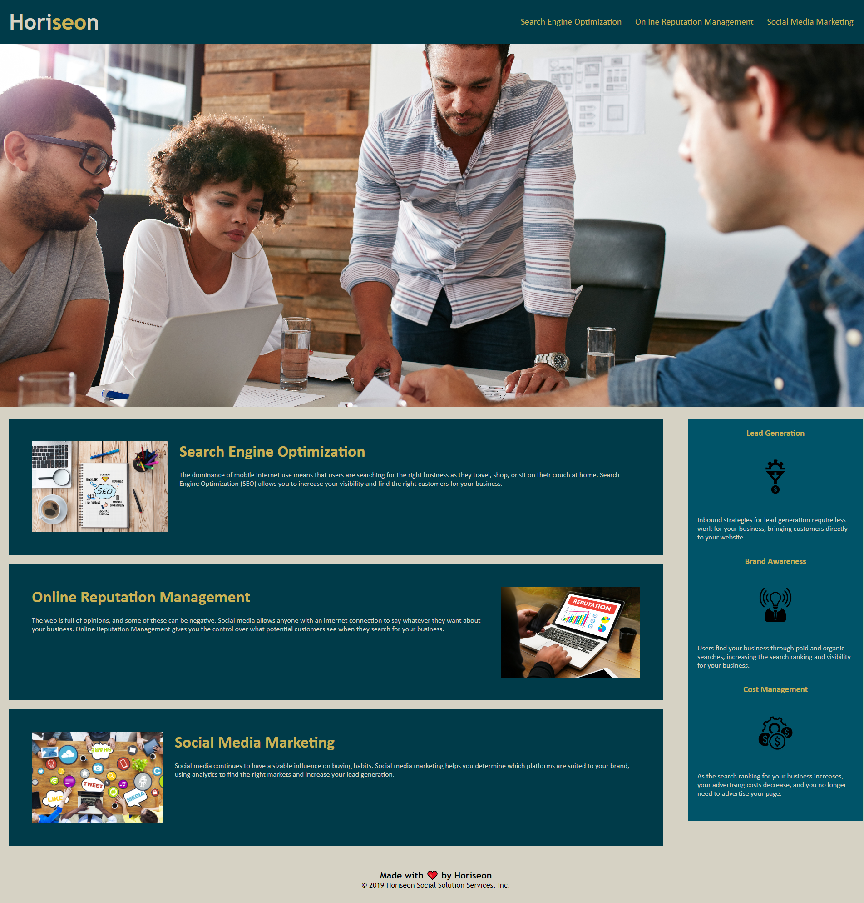

# Challenge-Assignment-01
Accessability/SEO optimization challenge for sprint 1.

## Introduction

This project was created to add in accessability properties to an existing webpage in order for assistive technologies to read the page more efficiently and effectively.
These properties also increase the search engine optimization of the webpage.

## Deployment

This project was deployed through GitHub pages. The following URL will bring you to the website. (https://jioriatti.github.io/Challenge-Assignment-01/)

The following image shows the web application's appearance and functionality:

